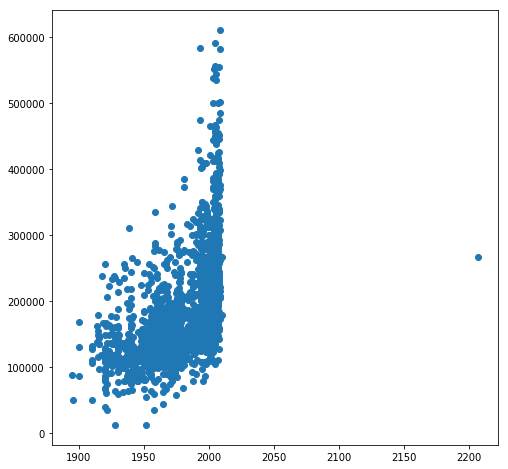

```python
import pandas as pd
import seaborn as sns
from matplotlib import pyplot as plt
from scipy import stats
from sklearn.utils import column_or_1d
from sklearn.linear_model import Lasso, LassoCV, Ridge, RidgeCV, ElasticNet, ElasticNetCV, LogisticRegression, LogisticRegressionCV
from sklearn.preprocessing import StandardScaler, PolynomialFeatures
from sklearn.model_selection import KFold
import numpy as np
```


```python
#This sends warning messages to the cornfield

import warnings
def ignore_warnings(*args, **kwargs):
    pass
warnings.warn = ignore_warnings
```


```python
train = pd.read_csv('./Data/train.csv')
test = pd.read_csv('./Data/test.csv')
```

Join test and train so we can do EDA, I used the keys 'test' and 'train' so that I can split the file easily when I'm done. Making a multi indexed array is a bit problamatic for certain instances but nameing the indexes solves the problem. Added sort = False to avoid a warning. It's good to get practice.


```python
test_train = pd.concat([test,train],keys = ['test','train'],sort = False)
```


```python
test_train.index.levels[0].name = 'og'
test_train.index.levels[1].name = 'pip'
```

Replacing spaces with _ and making everthing lowercase


```python
test_train.columns = [i.lower().replace(' ','_') for i in test_train.columns.get_values()]
```

The value year_remod/add puts the year constructed if no renovations ever took place. That's awful. Let's replace those values with 0 if no renovations took place


```python
test_train['year_remod/add'] = np.where(test_train['year_remod/add'] == test_train.year_built, 0, test_train['year_remod/add'])
        
#I tried to do this with .apply() but it wasn't happy.
```


```python
#test_train.info(verbose=True)
```


```python
>>> 
fig, ax = plt.subplots(figsize=(8,8))
plt.scatter(x=test_train.garage_yr_blt, y=test_train.saleprice)
#fig, ax = plt.subplots(figsize=(8,8));
```


    <matplotlib.collections.PathCollection at 0x7f0c5dc2e860>





Making a bunch of dummy variables. This includes some columns that appear to have numbers but these are just dates or codes


```python
test_train = pd.get_dummies(test_train, columns=['ms_zoning','street','alley','lot_shape','land_contour','utilities',
                                                 'lot_config', 'land_slope','neighborhood','condition_1','condition_2',
                                                 'bldg_type','house_style','roof_style','roof_matl','exterior_1st',
                                                 'exterior_2nd','mas_vnr_type','exter_qual','exter_cond', 'foundation',
                                                 'bsmt_qual','bsmt_cond','bsmt_exposure','bsmtfin_type_1',
                                                 'bsmtfin_type_2','heating','heating_qc','central_air',
                                                 'electrical','kitchen_qual','functional','garage_type',
                                                 'garage_finish','garage_qual','garage_cond','paved_drive',
                                                 'fence','misc_feature','sale_type','pool_qc','fireplace_qu', 
                                                 'garage_yr_blt','ms_subclass','year_built','year_remod/add',
                                                 'overall_qual','overall_cond'])
```

- Dropping garage_yr_blt_2207 because that's obviously a typo
- Dropping year_remod/add_0 because those are garbage values I put in


```python
test_train.drop(['garage_yr_blt_2207.0', 'year_remod/add_0'],axis = 1, inplace=True)
```

- Filling NaN values with the median or zero values so the data is still usable and it shouldn't affect the results poorly


```python
test_train.lot_frontage.fillna(test_train.lot_frontage.median(), inplace=True)
test_train.mas_vnr_area.fillna(0, inplace=True)
test_train.bsmtfin_sf_1.fillna(0, inplace=True)
test_train.bsmtfin_sf_2.fillna(0, inplace=True)
test_train.bsmt_unf_sf.fillna(0, inplace=True)
test_train.bsmt_full_bath.fillna(0, inplace=True)
test_train.bsmt_half_bath.fillna(0, inplace=True)
test_train.garage_cars.fillna(0, inplace=True)
test_train.garage_area.fillna(0, inplace=True)
test_train.total_bsmt_sf.fillna(0, inplace=True)
```

- Let's add up the square footage and use it as a column.


```python
#test_train.info(verbose=True)
```


```python
test_train['total_sf'] = test_train['1st_flr_sf'] + test_train['2nd_flr_sf'] + test_train['bsmtfin_sf_1'] + test_train['bsmtfin_sf_2']
```


```python
#test_train.info(verbose=True)
```

- Let's get rid of id and pid since those are only internal identifiers and have no berring on anything.


```python
test_train.drop(['id', 'pid'],axis = 1, inplace=True)
```

-Time to split up the dataframes


```python
X_test = pd.DataFrame(test_train.loc['test'])
X_test.to_csv('./Data/Test_Clean.csv', index=False)
```


```python
X_train = pd.DataFrame(test_train.loc['train'])
X_train.to_csv('./Data/Train_Clean.csv', index=False) 
```


```python
#X_train.head()
```

-Now lets see the coeff of the columns in our train data


```python
train_cor = X_train.corr()
#train_cor
```

- Let's get the values with the bigges and smallest corilation 


```python

corr_values_h = train_cor.nlargest(13,'saleprice')
#corr_values_h.T
#corr_values_l = X_train.nsmallest(10,'saleprice')
```

- Turn them into a list and merge the values we want


```python
#corr_l_lst = corr_values_l.index.get_values()
corr_h_lst = corr_values_h.index.get_values()
features = list(corr_h_lst) 
```

- Let's make some graphs  so we can see what we are working with.


```python
features
```


    ['saleprice',
     'total_sf',
     'gr_liv_area',
     'garage_area',
     'garage_cars',
     'total_bsmt_sf',
     '1st_flr_sf',
     'bsmt_qual_Ex',
     'kitchen_qual_Ex',
     'full_bath',
     'foundation_PConc',
     'totrms_abvgrd',
     'mas_vnr_area']


```python
fig, ax = plt.subplots(figsize=(8,8)) 
sns.heatmap(X_train[features].corr(),annot=True);
```


- Let's make a pariplot with these values to see if anything interesting is afoot


```python
#temp_feat = list(features[1,12])
#fig, ax = plt.subplots(figsize=(10,10)) 
#plt.rcParams['figure.figsize']=(20,20)

sns.pairplot(X_train[features], y_vars= X_train[features].columns.values.tolist(), 
             x_vars='saleprice', kind = "reg", size = 5);
#plt.rcParams['figure.figsize']=(20,20)
```


- something weird is going on. Looks like two people purchased some houses with very large basements with a;most no first floor for next to nothing. Missile silo? I don't want to know. Let's just dump it since it's messing up our data.


```python
X_train.drop(X_train.index[(X_train.total_sf >8000)], inplace=True) 
```


```python
sns.pairplot(X_train[features], y_vars= X_train[features].columns.values.tolist(), 
             x_vars='saleprice', kind = "reg", size = 5);
```


That's much better. 


```python
corr_values_h = train_cor.nlargest(13,'saleprice')
#corr_values_h.T
```

corr values did not change.


```python
#X_train.head()
```

Let's goof with y.


```python
y_train = pd.DataFrame(X_train.saleprice)
```


```python
fig, ax = plt.subplots(figsize=(8,8)) 
sns.distplot(y_train)
plt.xlabel='SalePrice';
```


Thats almost normal. Let's look at y in a probability graph. BTW, this didn't improve accuracy so I removed them.


```python
fig, ax = plt.subplots(figsize=(8,8)) 
stats.probplot(y_train.saleprice, plot=plt);
```


Taking the log to see if we get better results


```python
X_train_temp = pd.DataFrame(np.log(y_train.saleprice))
```


```python
fig, ax = plt.subplots(figsize=(8,8)) 
stats.probplot(X_train_temp.saleprice, plot=plt);
```


Eh. We should get rid of those two crazy low values.


```python
X_train_temp.drop(X_train.index[X_train_temp.saleprice == X_train_temp.saleprice.min()], inplace=True)
```


```python
X_train_temp.drop(X_train_temp.index[X_train_temp.saleprice == X_train_temp.saleprice.min()], inplace=True)
```


```python
fig, ax = plt.subplots(figsize=(8,8)) 
stats.probplot(X_train_temp.saleprice, plot=plt);
```


```python
y_train = pd.DataFrame(X_train.saleprice)
X_train.drop(['saleprice'], axis=1, inplace=True)
```


```python
#X_train.head()
```

Now let's drop the rogue saleprice column in test. It was filled with garbage anyway.


```python
X_test.drop(['saleprice'],axis=1, inplace=True)
```

Let's save everthing to csv so we don't have to do this again.


```python
X_train.to_csv('./Data/X_train_clean.csv',index=False)
y_train.to_csv('./Data/y_train_clean.csv',index=False)
X_test.to_csv('./Data/X_test_clean.csv',index=False)
```

Ok. Time to import the data modeling


```python
from sklearn.utils import column_or_1d
from sklearn.linear_model import Lasso, LassoCV, Ridge, RidgeCV, ElasticNet, ElasticNetCV, LogisticRegression, LogisticRegressionCV, LinearRegression
from sklearn.preprocessing import StandardScaler
from sklearn.model_selection import KFold
from sklearn.neighbors import KNeighborsClassifier
import statsmodels.api as sm
from scipy import stats
from keras.models import Sequential
from keras.layers import Dense
```

First let's scale the data.


```python
#X_train.head()
```


```python
ss = StandardScaler()
ss.fit(X_train)
X_train_sc = ss.transform(X_train)
X_test_sc = ss.transform(X_test)
```

Some models throw errors withou this


```python
y_train_array = column_or_1d(y_train)
```

Setting up KFold


```python
kf = KFold(n_splits=10, shuffle=True)
```

Now for the models. I'm going to start with Lasso and work fom there. I started with an alpha range of np.logspace(-4,-.5,30) and worker from there.


```python
l_alphas = np.logspace(2.7, 3,5, 100)
lasso_model = LassoCV(alphas=l_alphas, cv=kf)
lasso_model = lasso_model.fit(X_train_sc, y_train_array)
```


```python
optimus_alpha = lasso_model.alpha_
optimus_alpha
```


    501.18723362727246


```python
lasso_model.score(X_train_sc,y_train_array)
```


    0.9428432301217395


```python
cleo = lasso_model.predict(X_test_sc)

df_cleo = pd.DataFrame({'Id': test.Id,'SalePrice':cleo})

df_cleo.to_csv('./Data/True_Final_Lasso_sc.csv',index=False)

df_test = pd.read_csv('./Data/True_Final_Lasso_sc.csv')
df_test.head()
```


<div>
<style scoped>
    .dataframe tbody tr th:only-of-type {
        vertical-align: middle;
    }

    .dataframe tbody tr th {
        vertical-align: top;
    }

    .dataframe thead th {
        text-align: right;
    }
</style>
<table border="1" class="dataframe">
  <thead>
    <tr style="text-align: right;">
      <th></th>
      <th>Id</th>
      <th>SalePrice</th>
    </tr>
  </thead>
  <tbody>
    <tr>
      <th>0</th>
      <td>2658</td>
      <td>128401.235791</td>
    </tr>
    <tr>
      <th>1</th>
      <td>2718</td>
      <td>158315.899972</td>
    </tr>
    <tr>
      <th>2</th>
      <td>2414</td>
      <td>216220.167578</td>
    </tr>
    <tr>
      <th>3</th>
      <td>1989</td>
      <td>109909.212953</td>
    </tr>
    <tr>
      <th>4</th>
      <td>625</td>
      <td>180338.328114</td>
    </tr>
  </tbody>
</table>
</div>


This scored 36661.36783 in kaggle. Lets see Ridge. I started with the alpha range above. 


```python
r_alphas = np.logspace(2.65, 2.75, 100)
ridge_model = RidgeCV(alphas=r_alphas, cv=kf)
ridge_model = ridge_model.fit(X_train_sc, y_train_array)
```


```python
optimus_alpha_r = ridge_model.alpha_
optimus_alpha_r
```


    499.4417555536736


```python
ridge_model.score(X_train_sc,y_train_array)
```


    0.94853161144614


```python
cleo = ridge_model.predict(X_test_sc)

df_cleo = pd.DataFrame({'Id': test.Id,'SalePrice':cleo})

df_cleo.to_csv('./Data/True_Final_Ridge_Sc.csv',index=False)

df_test = pd.read_csv('./Data/True_Final_Ridge_Sc.csv')
df_test.head()
```


<div>
<style scoped>
    .dataframe tbody tr th:only-of-type {
        vertical-align: middle;
    }

    .dataframe tbody tr th {
        vertical-align: top;
    }

    .dataframe thead th {
        text-align: right;
    }
</style>
<table border="1" class="dataframe">
  <thead>
    <tr style="text-align: right;">
      <th></th>
      <th>Id</th>
      <th>SalePrice</th>
    </tr>
  </thead>
  <tbody>
    <tr>
      <th>0</th>
      <td>2658</td>
      <td>130907.140817</td>
    </tr>
    <tr>
      <th>1</th>
      <td>2718</td>
      <td>158863.905736</td>
    </tr>
    <tr>
      <th>2</th>
      <td>2414</td>
      <td>220761.858636</td>
    </tr>
    <tr>
      <th>3</th>
      <td>1989</td>
      <td>104464.115850</td>
    </tr>
    <tr>
      <th>4</th>
      <td>625</td>
      <td>179403.313969</td>
    </tr>
  </tbody>
</table>
</div>


This scored 36605.43933. Let's see Elastic net.


```python
enet_alphas = np.logspace(-1, 0.03, 100)
enet_ratio = 0.5
enet_model = ElasticNetCV(alphas=enet_alphas, l1_ratio=enet_ratio, cv=kf)
enet_model = enet_model.fit(X_train_sc, y_train_array)
```


```python
optimus_alpha_e = enet_model.alpha_
optimus_alpha_e
```


    0.5222504079284582


```python
enet_model.score(X_train_sc, y_train_array)
```


    0.9480712361310409


```python
cleo = enet_model.predict(X_test_sc)

df_cleo = pd.DataFrame({'Id': test.Id,'SalePrice':cleo})
df_cleo.to_csv('./Data/True_Final_ENet_sc_5.csv',index=False)

df_test = pd.read_csv('./Data/True_Final_ENet_sc_5.csv')
df_test.head()
```


<div>
<style scoped>
    .dataframe tbody tr th:only-of-type {
        vertical-align: middle;
    }

    .dataframe tbody tr th {
        vertical-align: top;
    }

    .dataframe thead th {
        text-align: right;
    }
</style>
<table border="1" class="dataframe">
  <thead>
    <tr style="text-align: right;">
      <th></th>
      <th>Id</th>
      <th>SalePrice</th>
    </tr>
  </thead>
  <tbody>
    <tr>
      <th>0</th>
      <td>2658</td>
      <td>129750.173948</td>
    </tr>
    <tr>
      <th>1</th>
      <td>2718</td>
      <td>159076.418537</td>
    </tr>
    <tr>
      <th>2</th>
      <td>2414</td>
      <td>220921.508953</td>
    </tr>
    <tr>
      <th>3</th>
      <td>1989</td>
      <td>104722.899230</td>
    </tr>
    <tr>
      <th>4</th>
      <td>625</td>
      <td>179592.408132</td>
    </tr>
  </tbody>
</table>
</div>


This scorred 36630.94268. Changing the ENet ratio probably will not help since they are so close. Let's move on to more exotic means.


```python
X_train_c = sm.add_constant(X_train)
X_test_c = sm.add_constant(X_test)

results = sm.GLM(y_train,
                 X_train_c,
                 family = sm.families.Gamma())
gamma_results =results.fit()
#results.summary()

print(gamma_results.summary())
```

                     Generalized Linear Model Regression Results                  
    ==============================================================================
    Dep. Variable:              saleprice   No. Observations:                 2049
    Model:                            GLM   Df Residuals:                     1516
    Model Family:                   Gamma   Df Model:                          532
    Link Function:          inverse_power   Scale:                        0.010724
    Method:                          IRLS   Log-Likelihood:                -22685.
    Date:                Wed, 22 Aug 2018   Deviance:                       17.350
    Time:                        23:06:20   Pearson chi2:                     16.3
    No. Iterations:                    12   Covariance Type:             nonrobust
    ========================================================================================
                               coef    std err          z      P>|z|      [0.025      0.975]
    ----------------------------------------------------------------------------------------
    const                -1.807e-06   3.55e-06     -0.510      0.610   -8.76e-06    5.14e-06
    lot_frontage          -3.03e-09    9.6e-10     -3.157      0.002   -4.91e-09   -1.15e-09
    lot_area              -1.51e-11   3.02e-12     -4.999      0.000    -2.1e-11   -9.18e-12
    mas_vnr_area          1.576e-10   9.85e-11      1.600      0.110   -3.55e-11    3.51e-10
    bsmtfin_sf_1         -6.239e-11   7.61e-11     -0.820      0.412   -2.11e-10    8.67e-11
    bsmtfin_sf_2           2.14e-10   1.18e-10      1.813      0.070   -1.73e-11    4.45e-10
    bsmt_unf_sf           -1.24e-10   6.14e-11     -2.020      0.043   -2.44e-10   -3.69e-12
    total_bsmt_sf         2.769e-11   8.55e-11      0.324      0.746    -1.4e-10    1.95e-10
    1st_flr_sf           -4.039e-10   1.18e-10     -3.435      0.001   -6.34e-10   -1.73e-10
    2nd_flr_sf           -9.524e-12   1.02e-10     -0.094      0.925   -2.09e-10     1.9e-10
    low_qual_fin_sf      -2.279e-10   3.28e-10     -0.694      0.487   -8.71e-10    4.15e-10
    gr_liv_area          -6.413e-10   1.74e-10     -3.689      0.000   -9.82e-10   -3.01e-10
    bsmt_full_bath       -1.013e-07   4.35e-08     -2.330      0.020   -1.87e-07   -1.61e-08
    bsmt_half_bath       -4.094e-08   7.03e-08     -0.582      0.560   -1.79e-07    9.69e-08
    full_bath             -1.73e-07   4.82e-08     -3.593      0.000   -2.67e-07   -7.86e-08
    half_bath            -6.868e-08   4.43e-08     -1.551      0.121   -1.55e-07    1.81e-08
    bedroom_abvgr        -6.035e-09      3e-08     -0.201      0.840   -6.48e-08    5.27e-08
    kitchen_abvgr         2.941e-07   2.19e-07      1.342      0.180   -1.35e-07    7.24e-07
    totrms_abvgrd        -1.171e-08   1.87e-08     -0.626      0.532   -4.84e-08     2.5e-08
    fireplaces            -1.16e-08   5.03e-08     -0.231      0.818    -1.1e-07     8.7e-08
    garage_cars          -7.087e-08   5.06e-08     -1.400      0.162    -1.7e-07    2.83e-08
    garage_area          -5.479e-10   1.57e-10     -3.495      0.000   -8.55e-10   -2.41e-10
    wood_deck_sf         -3.604e-10    1.2e-10     -2.992      0.003   -5.97e-10   -1.24e-10
    open_porch_sf        -4.049e-10   2.37e-10     -1.711      0.087   -8.69e-10    5.88e-11
    enclosed_porch       -7.156e-10   3.17e-10     -2.258      0.024   -1.34e-09   -9.43e-11
    3ssn_porch           -2.262e-10   5.11e-10     -0.443      0.658   -1.23e-09    7.76e-10
    screen_porch         -1.357e-09   2.43e-10     -5.592      0.000   -1.83e-09   -8.81e-10
    pool_area             1.326e-09   3.34e-09      0.397      0.691   -5.21e-09    7.87e-09
    misc_val             -6.986e-11   7.23e-11     -0.966      0.334   -2.12e-10    7.19e-11
    mo_sold              -4.994e-09   5.26e-09     -0.949      0.343   -1.53e-08    5.32e-09
    yr_sold               1.945e-08   1.23e-08      1.586      0.113   -4.59e-09    4.35e-08
    ms_zoning_A (agr)    -3.834e-06    2.5e-06     -1.533      0.125   -8.73e-06    1.07e-06
    ms_zoning_C (all)     2.437e-06   7.45e-07      3.272      0.001    9.77e-07     3.9e-06
    ms_zoning_FV         -3.674e-08   6.68e-07     -0.055      0.956   -1.35e-06    1.27e-06
    ms_zoning_I (all)    -1.361e-06   1.22e-06     -1.113      0.266   -3.76e-06    1.04e-06
    ms_zoning_RH          4.131e-07    6.9e-07      0.599      0.549   -9.39e-07    1.77e-06
    ms_zoning_RL          1.448e-07    6.6e-07      0.219      0.826   -1.15e-06    1.44e-06
    ms_zoning_RM          4.299e-07   6.65e-07      0.647      0.518   -8.73e-07    1.73e-06
    street_Grvl          -4.385e-07   1.79e-06     -0.245      0.807   -3.95e-06    3.07e-06
    street_Pave          -1.368e-06   1.79e-06     -0.764      0.445   -4.88e-06    2.14e-06
    alley_Grvl            -1.35e-07   1.46e-07     -0.923      0.356   -4.22e-07    1.52e-07
    alley_Pave             1.16e-07   1.13e-07      1.023      0.307   -1.06e-07    3.38e-07
    lot_shape_IR1        -4.983e-07    8.9e-07     -0.560      0.576   -2.24e-06    1.25e-06
    lot_shape_IR2        -4.734e-07    8.9e-07     -0.532      0.595   -2.22e-06    1.27e-06
    lot_shape_IR3        -3.181e-07   8.94e-07     -0.356      0.722   -2.07e-06    1.43e-06
    lot_shape_Reg        -5.171e-07   8.92e-07     -0.580      0.562   -2.27e-06    1.23e-06
    land_contour_Bnk     -4.927e-07    8.9e-07     -0.553      0.580   -2.24e-06    1.25e-06
    land_contour_HLS     -3.546e-07   8.89e-07     -0.399      0.690    -2.1e-06    1.39e-06
    land_contour_Low      -5.86e-07    8.9e-07     -0.658      0.510   -2.33e-06    1.16e-06
    land_contour_Lvl     -3.737e-07   8.89e-07     -0.420      0.674   -2.12e-06    1.37e-06
    utilities_AllPub     -7.665e-07   1.42e-06     -0.539      0.590   -3.55e-06    2.02e-06
    utilities_NoSeWa       3.21e-07    1.5e-06      0.214      0.831   -2.62e-06    3.26e-06
    utilities_NoSewr     -1.361e-06   1.22e-06     -1.113      0.266   -3.76e-06    1.04e-06
    lot_config_Corner    -4.114e-07   7.12e-07     -0.578      0.564   -1.81e-06    9.85e-07
    lot_config_CulDSac   -5.813e-07   7.13e-07     -0.815      0.415   -1.98e-06    8.17e-07
    lot_config_FR2       -3.411e-07   7.13e-07     -0.479      0.632   -1.74e-06    1.06e-06
    lot_config_FR3       -5.992e-08   7.21e-07     -0.083      0.934   -1.47e-06    1.35e-06
    lot_config_Inside    -4.133e-07   7.11e-07     -0.581      0.561   -1.81e-06     9.8e-07
    land_slope_Gtl       -7.338e-07   1.19e-06     -0.619      0.536   -3.06e-06    1.59e-06
    land_slope_Mod       -7.477e-07   1.19e-06     -0.628      0.530   -3.08e-06    1.58e-06
    land_slope_Sev       -3.255e-07   1.19e-06     -0.272      0.785   -2.67e-06    2.02e-06
    neighborhood_Blmngtn   2.03e-07   1.95e-07      1.041      0.298   -1.79e-07    5.85e-07
    neighborhood_Blueste -4.803e-07   3.78e-07     -1.270      0.204   -1.22e-06    2.61e-07
    neighborhood_BrDale   5.504e-07   3.28e-07      1.677      0.093   -9.27e-08    1.19e-06
    neighborhood_BrkSide  4.942e-08   2.17e-07      0.228      0.820   -3.76e-07    4.74e-07
    neighborhood_ClearCr -4.156e-07   1.94e-07     -2.137      0.033   -7.97e-07   -3.44e-08
    neighborhood_CollgCr   1.47e-07    1.5e-07      0.979      0.328   -1.47e-07    4.41e-07
    neighborhood_Crawfor -5.353e-07   1.63e-07     -3.274      0.001   -8.56e-07   -2.15e-07
    neighborhood_Edwards   3.08e-07   1.59e-07      1.936      0.053   -3.79e-09     6.2e-07
    neighborhood_Gilbert  1.048e-07   1.63e-07      0.645      0.519   -2.14e-07    4.23e-07
    neighborhood_Greens  -1.088e-06   3.86e-07     -2.817      0.005   -1.84e-06   -3.31e-07
    neighborhood_GrnHill -2.029e-06   3.46e-07     -5.871      0.000   -2.71e-06   -1.35e-06
    neighborhood_IDOTRR   9.047e-08   2.46e-07      0.367      0.713   -3.92e-07    5.73e-07
    neighborhood_Landmrk -4.029e-07   8.04e-07     -0.501      0.616   -1.98e-06    1.17e-06
    neighborhood_MeadowV  1.039e-06   3.02e-07      3.440      0.001    4.47e-07    1.63e-06
    neighborhood_Mitchel  2.488e-08   1.63e-07      0.152      0.879   -2.95e-07    3.45e-07
    neighborhood_NAmes    9.352e-08   1.54e-07      0.606      0.545   -2.09e-07    3.96e-07
    neighborhood_NPkVill  6.113e-07   4.88e-07      1.253      0.210   -3.45e-07    1.57e-06
    neighborhood_NWAmes  -1.196e-07   1.59e-07     -0.751      0.453   -4.32e-07    1.93e-07
    neighborhood_NoRidge  1.371e-07   1.63e-07      0.843      0.399   -1.82e-07    4.56e-07
    neighborhood_NridgHt -7.908e-08   1.56e-07     -0.509      0.611   -3.84e-07    2.26e-07
    neighborhood_OldTown  1.191e-07   2.05e-07      0.582      0.561   -2.82e-07     5.2e-07
    neighborhood_SWISU    7.873e-08   2.41e-07      0.327      0.744   -3.93e-07    5.51e-07
    neighborhood_Sawyer   1.315e-07   1.71e-07      0.771      0.441   -2.03e-07    4.66e-07
    neighborhood_SawyerW  1.497e-07   1.65e-07      0.906      0.365   -1.74e-07    4.74e-07
    neighborhood_Somerst  1.799e-08   1.71e-07      0.105      0.916   -3.17e-07    3.53e-07
    neighborhood_StoneBr -2.694e-07   1.65e-07     -1.635      0.102   -5.92e-07    5.36e-08
    neighborhood_Timber   -4.61e-08    1.6e-07     -0.287      0.774    -3.6e-07    2.68e-07
    neighborhood_Veenker -1.978e-07      2e-07     -0.988      0.323    -5.9e-07    1.94e-07
    condition_1_Artery    3.697e-07   4.23e-07      0.874      0.382    -4.6e-07     1.2e-06
    condition_1_Feedr    -2.797e-07   4.04e-07     -0.693      0.488   -1.07e-06    5.11e-07
    condition_1_Norm     -3.766e-07      4e-07     -0.942      0.346   -1.16e-06    4.07e-07
    condition_1_PosA     -4.722e-07   4.34e-07     -1.088      0.276   -1.32e-06    3.78e-07
    condition_1_PosN     -3.349e-07   4.15e-07     -0.807      0.420   -1.15e-06    4.78e-07
    condition_1_RRAe      1.356e-07   4.28e-07      0.317      0.751   -7.03e-07    9.74e-07
    condition_1_RRAn     -1.811e-07   4.07e-07     -0.445      0.656   -9.79e-07    6.17e-07
    condition_1_RRNe     -5.553e-07   6.13e-07     -0.905      0.365   -1.76e-06    6.47e-07
    condition_1_RRNn     -1.126e-07   4.53e-07     -0.249      0.804      -1e-06    7.75e-07
    condition_2_Artery   -1.485e-07   6.33e-07     -0.234      0.815   -1.39e-06    1.09e-06
    condition_2_Feedr    -3.731e-07   5.61e-07     -0.665      0.506   -1.47e-06    7.27e-07
    condition_2_Norm     -2.753e-07   4.91e-07     -0.561      0.575   -1.24e-06    6.86e-07
    condition_2_PosA     -4.159e-07   5.56e-07     -0.748      0.454    -1.5e-06    6.73e-07
    condition_2_PosN     -1.431e-07   5.23e-07     -0.274      0.784   -1.17e-06    8.82e-07
    condition_2_RRAe     -2.846e-07   9.59e-07     -0.297      0.767   -2.16e-06     1.6e-06
    condition_2_RRAn      1.036e-08   8.47e-07      0.012      0.990   -1.65e-06    1.67e-06
    condition_2_RRNn     -1.768e-07   8.91e-07     -0.198      0.843   -1.92e-06    1.57e-06
    bldg_type_1Fam       -5.505e-07   7.87e-07     -0.700      0.484   -2.09e-06    9.91e-07
    bldg_type_2fmCon      3.726e-07   9.59e-07      0.388      0.698   -1.51e-06    2.25e-06
    bldg_type_Duplex     -4.137e-07   5.02e-07     -0.824      0.410    -1.4e-06    5.71e-07
    bldg_type_Twnhs      -4.545e-07   8.04e-07     -0.565      0.572   -2.03e-06    1.12e-06
    bldg_type_TwnhsE     -7.608e-07      8e-07     -0.951      0.342   -2.33e-06    8.07e-07
    house_style_1.5Fin    4.846e-09   5.17e-07      0.009      0.993   -1.01e-06    1.02e-06
    house_style_1.5Unf   -4.944e-07   8.12e-07     -0.609      0.542   -2.08e-06     1.1e-06
    house_style_1Story    1.321e-08    4.9e-07      0.027      0.979   -9.48e-07    9.74e-07
    house_style_2.5Fin   -5.048e-07   6.24e-07     -0.809      0.419   -1.73e-06    7.19e-07
    house_style_2.5Unf    -2.96e-07    5.7e-07     -0.520      0.603   -1.41e-06    8.21e-07
    house_style_2Story   -1.465e-07   4.87e-07     -0.301      0.764    -1.1e-06    8.08e-07
    house_style_SFoyer   -1.394e-07   5.13e-07     -0.272      0.786   -1.14e-06    8.66e-07
    house_style_SLvl      -2.44e-07   5.52e-07     -0.442      0.658   -1.33e-06    8.37e-07
    roof_style_Flat      -6.104e-07   6.62e-07     -0.922      0.357   -1.91e-06    6.87e-07
    roof_style_Gable     -5.867e-07   6.05e-07     -0.969      0.333   -1.77e-06       6e-07
    roof_style_Gambrel   -1.108e-07   6.51e-07     -0.170      0.865   -1.39e-06    1.16e-06
    roof_style_Hip       -5.359e-07   6.07e-07     -0.883      0.377   -1.73e-06    6.53e-07
    roof_style_Mansard    9.041e-07   6.68e-07      1.354      0.176   -4.05e-07    2.21e-06
    roof_style_Shed      -8.672e-07   7.17e-07     -1.210      0.226   -2.27e-06    5.37e-07
    roof_matl_ClyTile    -2.524e-20   1.27e-20     -1.989      0.047   -5.01e-20   -3.63e-22
    roof_matl_CompShg     1.662e-08   7.33e-07      0.023      0.982   -1.42e-06    1.45e-06
    roof_matl_Membran    -1.426e-06      9e-07     -1.585      0.113   -3.19e-06    3.38e-07
    roof_matl_Metal      -2.649e-19   4.44e-20     -5.960      0.000   -3.52e-19   -1.78e-19
    roof_matl_Roll       -4.869e-20   1.03e-20     -4.715      0.000   -6.89e-20   -2.85e-20
    roof_matl_Tar&Grv     6.975e-08   7.46e-07      0.093      0.926   -1.39e-06    1.53e-06
    roof_matl_WdShake     -4.17e-07   7.73e-07     -0.539      0.590   -1.93e-06     1.1e-06
    roof_matl_WdShngl    -5.056e-08    7.7e-07     -0.066      0.948   -1.56e-06    1.46e-06
    exterior_1st_AsbShng  -3.27e-07   4.59e-07     -0.713      0.476   -1.23e-06    5.72e-07
    exterior_1st_AsphShn  6.298e-07   1.44e-06      0.437      0.662   -2.19e-06    3.45e-06
    exterior_1st_BrkComm   8.76e-07   7.65e-07      1.146      0.252   -6.23e-07    2.37e-06
    exterior_1st_BrkFace -9.773e-07   3.16e-07     -3.090      0.002    -1.6e-06   -3.57e-07
    exterior_1st_CBlock  -1.004e-06   1.77e-06     -0.568      0.570   -4.47e-06    2.46e-06
    exterior_1st_CemntBd  6.814e-07   4.53e-07      1.505      0.132   -2.06e-07    1.57e-06
    exterior_1st_HdBoard  -1.89e-07   3.06e-07     -0.617      0.537    -7.9e-07    4.12e-07
    exterior_1st_ImStucc -5.514e-11   5.27e-07     -0.000      1.000   -1.03e-06    1.03e-06
    exterior_1st_MetalSd -5.084e-07   3.53e-07     -1.438      0.150    -1.2e-06    1.84e-07
    exterior_1st_Plywood -2.787e-07   3.09e-07     -0.903      0.366   -8.83e-07    3.26e-07
    exterior_1st_PreCast    2.4e-19   3.61e-20      6.644      0.000    1.69e-19    3.11e-19
    exterior_1st_Stone    3.361e-07   5.16e-07      0.651      0.515   -6.76e-07    1.35e-06
    exterior_1st_Stucco  -4.176e-07   3.79e-07     -1.102      0.270   -1.16e-06    3.25e-07
    exterior_1st_VinylSd -2.119e-07    3.4e-07     -0.623      0.533   -8.78e-07    4.54e-07
    exterior_1st_Wd Sdng  1.418e-08   3.11e-07      0.046      0.964   -5.96e-07    6.24e-07
    exterior_1st_WdShing -4.305e-07   3.34e-07     -1.287      0.198   -1.09e-06    2.25e-07
    exterior_2nd_AsbShng  5.738e-07   4.43e-07      1.295      0.195   -2.95e-07    1.44e-06
    exterior_2nd_AsphShn -1.269e-06   5.82e-07     -2.179      0.029   -2.41e-06   -1.27e-07
    exterior_2nd_Brk Cmn -9.765e-07   5.72e-07     -1.709      0.088    -2.1e-06    1.44e-07
    exterior_2nd_BrkFace  4.166e-07    3.1e-07      1.346      0.178    -1.9e-07    1.02e-06
    exterior_2nd_CBlock   2.036e-06   1.39e-06      1.467      0.142   -6.84e-07    4.76e-06
    exterior_2nd_CmentBd -1.113e-06   4.09e-07     -2.719      0.007   -1.91e-06    -3.1e-07
    exterior_2nd_HdBoard  -1.94e-07   2.93e-07     -0.663      0.507   -7.68e-07    3.79e-07
    exterior_2nd_ImStucc -3.833e-07   3.11e-07     -1.233      0.218   -9.93e-07    2.26e-07
    exterior_2nd_MetalSd -1.285e-08   3.31e-07     -0.039      0.969   -6.61e-07    6.35e-07
    exterior_2nd_Other   -1.187e-19   2.13e-20     -5.569      0.000   -1.61e-19   -7.69e-20
    exterior_2nd_Plywood -2.245e-07    2.9e-07     -0.774      0.439   -7.93e-07    3.44e-07
    exterior_2nd_PreCast  3.187e-19   5.07e-20      6.292      0.000    2.19e-19    4.18e-19
    exterior_2nd_Stone   -1.298e-07   4.92e-07     -0.264      0.792   -1.09e-06    8.34e-07
    exterior_2nd_Stucco  -7.859e-08   3.54e-07     -0.222      0.824   -7.72e-07    6.14e-07
    exterior_2nd_VinylSd -9.591e-08   3.23e-07     -0.297      0.766   -7.29e-07    5.37e-07
    exterior_2nd_Wd Sdng  -3.67e-07   2.86e-07     -1.283      0.199   -9.27e-07    1.94e-07
    exterior_2nd_Wd Shng  1.048e-08   3.04e-07      0.034      0.972   -5.85e-07    6.06e-07
    mas_vnr_type_BrkCmn   5.108e-07   2.72e-07      1.879      0.060   -2.19e-08    1.04e-06
    mas_vnr_type_BrkFace  -2.57e-09   1.15e-07     -0.022      0.982   -2.28e-07    2.23e-07
    mas_vnr_type_CBlock  -3.674e-20   9.59e-21     -3.830      0.000   -5.55e-20   -1.79e-20
    mas_vnr_type_None     8.705e-08    1.1e-07      0.789      0.430   -1.29e-07    3.03e-07
    mas_vnr_type_Stone   -1.838e-08   1.15e-07     -0.160      0.873   -2.44e-07    2.07e-07
    exter_qual_Ex        -4.791e-07   8.93e-07     -0.536      0.592   -2.23e-06    1.27e-06
    exter_qual_Fa        -7.335e-07   9.15e-07     -0.801      0.423   -2.53e-06    1.06e-06
    exter_qual_Gd        -3.646e-07    8.9e-07     -0.410      0.682   -2.11e-06    1.38e-06
    exter_qual_TA        -2.298e-07   8.87e-07     -0.259      0.796   -1.97e-06    1.51e-06
    exter_cond_Ex        -1.175e-05   1.85e-06     -6.369      0.000   -1.54e-05   -8.14e-06
    exter_cond_Fa        -1.162e-05   1.83e-06     -6.340      0.000   -1.52e-05   -8.03e-06
    exter_cond_Gd         -1.18e-05   1.84e-06     -6.423      0.000   -1.54e-05    -8.2e-06
    exter_cond_Po         4.522e-05   7.07e-06      6.400      0.000    3.14e-05    5.91e-05
    exter_cond_TA        -1.185e-05   1.84e-06     -6.447      0.000   -1.54e-05   -8.25e-06
    foundation_BrkTil     -1.06e-07   6.12e-07     -0.173      0.863   -1.31e-06    1.09e-06
    foundation_CBlock    -2.499e-07   6.04e-07     -0.414      0.679   -1.43e-06    9.34e-07
    foundation_PConc     -3.278e-07   6.07e-07     -0.540      0.589   -1.52e-06    8.62e-07
    foundation_Slab      -5.115e-08   6.59e-07     -0.078      0.938   -1.34e-06    1.24e-06
    foundation_Stone     -5.423e-07      7e-07     -0.775      0.438   -1.91e-06     8.3e-07
    foundation_Wood      -5.299e-07   7.04e-07     -0.753      0.452   -1.91e-06     8.5e-07
    bsmt_qual_Ex         -6.436e-07   2.72e-07     -2.370      0.018   -1.18e-06   -1.11e-07
    bsmt_qual_Fa         -2.024e-07   2.93e-07     -0.691      0.489   -7.76e-07    3.71e-07
    bsmt_qual_Gd         -6.476e-07   2.66e-07     -2.436      0.015   -1.17e-06   -1.27e-07
    bsmt_qual_Po          2.567e-07   7.16e-07      0.358      0.720   -1.15e-06    1.66e-06
    bsmt_qual_TA          -6.21e-07   2.66e-07     -2.331      0.020   -1.14e-06   -9.89e-08
    bsmt_cond_Ex         -3.722e-07   4.09e-07     -0.910      0.363   -1.17e-06    4.29e-07
    bsmt_cond_Fa          2.807e-07   2.64e-07      1.064      0.287   -2.36e-07    7.98e-07
    bsmt_cond_Gd         -1.183e-07   2.48e-07     -0.478      0.633   -6.04e-07    3.67e-07
    bsmt_cond_Po         -1.607e-06    6.4e-07     -2.511      0.012   -2.86e-06   -3.53e-07
    bsmt_cond_TA         -4.046e-08   2.42e-07     -0.167      0.867   -5.15e-07    4.34e-07
    bsmt_exposure_Av       2.22e-08   2.97e-07      0.075      0.940   -5.59e-07    6.04e-07
    bsmt_exposure_Gd     -9.172e-08   2.99e-07     -0.306      0.759   -6.78e-07    4.95e-07
    bsmt_exposure_Mn      8.851e-08   2.99e-07      0.296      0.767   -4.97e-07    6.74e-07
    bsmt_exposure_No      8.404e-08   2.96e-07      0.284      0.777   -4.96e-07    6.64e-07
    bsmtfin_type_1_ALQ   -4.409e-07   1.91e-07     -2.307      0.021   -8.15e-07   -6.64e-08
    bsmtfin_type_1_BLQ   -3.786e-07   1.92e-07     -1.974      0.048   -7.55e-07   -2.61e-09
    bsmtfin_type_1_GLQ   -3.078e-07   1.89e-07     -1.630      0.103   -6.78e-07    6.23e-08
    bsmtfin_type_1_LwQ   -3.966e-07   2.01e-07     -1.978      0.048    -7.9e-07   -3.53e-09
    bsmtfin_type_1_Rec   -1.734e-07   1.94e-07     -0.895      0.371   -5.53e-07    2.06e-07
    bsmtfin_type_1_Unf   -1.604e-07   1.87e-07     -0.858      0.391   -5.27e-07    2.06e-07
    bsmtfin_type_2_ALQ     5.74e-08   4.17e-07      0.138      0.891    -7.6e-07    8.75e-07
    bsmtfin_type_2_BLQ    2.523e-07   4.22e-07      0.598      0.550   -5.75e-07    1.08e-06
    bsmtfin_type_2_GLQ   -7.454e-08   4.41e-07     -0.169      0.866   -9.38e-07    7.89e-07
    bsmtfin_type_2_LwQ    4.047e-08   4.26e-07      0.095      0.924   -7.94e-07    8.75e-07
    bsmtfin_type_2_Rec    8.369e-08   4.18e-07      0.200      0.841   -7.36e-07    9.03e-07
    bsmtfin_type_2_Unf    3.075e-08   4.16e-07      0.074      0.941   -7.85e-07    8.47e-07
    heating_Floor          1.01e-20   8.83e-21      1.144      0.253   -7.21e-21    2.74e-20
    heating_GasA         -8.683e-07   7.83e-07     -1.109      0.268    -2.4e-06    6.67e-07
    heating_GasW         -1.475e-06   7.97e-07     -1.850      0.064   -3.04e-06    8.76e-08
    heating_Grav          2.869e-06   9.78e-07      2.933      0.003    9.52e-07    4.79e-06
    heating_OthW          -9.56e-07   7.89e-07     -1.212      0.225    -2.5e-06     5.9e-07
    heating_Wall         -1.377e-06   9.34e-07     -1.474      0.140   -3.21e-06    4.54e-07
    heating_qc_Ex        -6.127e-07   7.29e-07     -0.841      0.401   -2.04e-06    8.16e-07
    heating_qc_Fa        -4.451e-07    7.4e-07     -0.601      0.548    -1.9e-06    1.01e-06
    heating_qc_Gd        -5.665e-07   7.28e-07     -0.778      0.436   -1.99e-06     8.6e-07
    heating_qc_Po         2.845e-07   1.01e-06      0.282      0.778   -1.69e-06    2.26e-06
    heating_qc_TA        -4.672e-07    7.3e-07     -0.640      0.522    -1.9e-06    9.64e-07
    central_air_N        -7.206e-07   1.77e-06     -0.406      0.685    -4.2e-06    2.76e-06
    central_air_Y        -1.086e-06   1.77e-06     -0.613      0.540   -4.56e-06    2.39e-06
    electrical_FuseA     -7.548e-08   9.25e-07     -0.082      0.935   -1.89e-06    1.74e-06
    electrical_FuseF      7.964e-08   9.36e-07      0.085      0.932   -1.76e-06    1.91e-06
    electrical_FuseP      1.144e-07   1.03e-06      0.111      0.912   -1.91e-06    2.14e-06
    electrical_Mix       -1.902e-06    2.5e-06     -0.762      0.446   -6.79e-06    2.99e-06
    electrical_SBrkr     -2.374e-08    9.2e-07     -0.026      0.979   -1.83e-06    1.78e-06
    kitchen_qual_Ex      -6.078e-07    8.9e-07     -0.683      0.495   -2.35e-06    1.14e-06
    kitchen_qual_Fa      -2.429e-07   8.96e-07     -0.271      0.786      -2e-06    1.51e-06
    kitchen_qual_Gd      -5.244e-07   8.89e-07     -0.590      0.555   -2.27e-06    1.22e-06
    kitchen_qual_Po       3.094e-20   6.69e-21      4.625      0.000    1.78e-20    4.41e-20
    kitchen_qual_TA      -4.318e-07   8.88e-07     -0.486      0.627   -2.17e-06    1.31e-06
    functional_Maj1      -1.397e-06   6.29e-07     -2.220      0.026   -2.63e-06   -1.63e-07
    functional_Maj2      -2.231e-07   7.44e-07     -0.300      0.764   -1.68e-06    1.23e-06
    functional_Min1      -1.644e-06   6.08e-07     -2.702      0.007   -2.84e-06   -4.52e-07
    functional_Min2      -1.692e-06    6.1e-07     -2.772      0.006   -2.89e-06   -4.95e-07
    functional_Mod       -1.034e-06   6.23e-07     -1.658      0.097   -2.26e-06    1.88e-07
    functional_Sal        6.087e-06   2.22e-06      2.740      0.006    1.73e-06    1.04e-05
    functional_Sev       -1.759e-07   1.05e-06     -0.168      0.867   -2.23e-06    1.88e-06
    functional_Typ       -1.728e-06   5.96e-07     -2.898      0.004    -2.9e-06   -5.59e-07
    garage_type_2Types   -4.386e-07    9.7e-07     -0.452      0.651   -2.34e-06    1.46e-06
    garage_type_Attchd   -7.193e-07   9.47e-07     -0.759      0.448   -2.58e-06    1.14e-06
    garage_type_Basment  -5.881e-07   9.63e-07     -0.611      0.541   -2.48e-06     1.3e-06
    garage_type_BuiltIn  -6.567e-07   9.49e-07     -0.692      0.489   -2.52e-06     1.2e-06
    garage_type_CarPort  -4.136e-07   1.01e-06     -0.411      0.681   -2.39e-06    1.56e-06
    garage_type_Detchd   -5.772e-07   9.44e-07     -0.611      0.541   -2.43e-06    1.27e-06
    garage_finish_Fin     4.281e-07   5.25e-07      0.815      0.415   -6.02e-07    1.46e-06
    garage_finish_RFn     4.045e-07   5.24e-07      0.771      0.441   -6.23e-07    1.43e-06
    garage_finish_Unf     4.367e-07   5.23e-07      0.835      0.404   -5.89e-07    1.46e-06
    garage_qual_Ex       -9.092e-07    4.7e-07     -1.935      0.053   -1.83e-06    1.16e-08
    garage_qual_Fa       -5.874e-07   4.76e-07     -1.235      0.217   -1.52e-06    3.45e-07
    garage_qual_Gd       -6.342e-07   4.79e-07     -1.324      0.186   -1.57e-06    3.05e-07
    garage_qual_Po        4.263e-06   1.82e-06      2.340      0.019    6.92e-07    7.83e-06
    garage_qual_TA       -8.628e-07   4.62e-07     -1.868      0.062   -1.77e-06    4.26e-08
    garage_cond_Ex       -1.828e-08   5.98e-07     -0.031      0.976   -1.19e-06    1.15e-06
    garage_cond_Fa        7.997e-07   3.96e-07      2.018      0.044    2.32e-08    1.58e-06
    garage_cond_Gd        3.449e-07      4e-07      0.863      0.388   -4.39e-07    1.13e-06
    garage_cond_Po       -4.836e-07   5.18e-07     -0.933      0.351    -1.5e-06    5.32e-07
    garage_cond_TA        6.265e-07   3.65e-07      1.717      0.086   -8.88e-08    1.34e-06
    paved_drive_N        -3.547e-07   1.18e-06     -0.299      0.765   -2.68e-06    1.97e-06
    paved_drive_P        -6.771e-07   1.19e-06     -0.571      0.568      -3e-06    1.65e-06
    paved_drive_Y        -7.751e-07   1.18e-06     -0.654      0.513    -3.1e-06    1.55e-06
    fence_GdPrv          -2.206e-08   8.58e-08     -0.257      0.797    -1.9e-07    1.46e-07
    fence_GdWo            1.685e-07   9.68e-08      1.741      0.082   -2.12e-08    3.58e-07
    fence_MnPrv           6.441e-08   6.14e-08      1.049      0.294    -5.6e-08    1.85e-07
    fence_MnWw            4.985e-08   2.73e-07      0.182      0.855   -4.86e-07    5.86e-07
    misc_feature_Elev    -1.533e-20   6.31e-21     -2.431      0.015   -2.77e-20   -2.97e-21
    misc_feature_Gar2     3.237e-07   7.75e-07      0.418      0.676    -1.2e-06    1.84e-06
    misc_feature_Othr    -3.476e-07   4.97e-07     -0.699      0.484   -1.32e-06    6.27e-07
    misc_feature_Shed     1.052e-07   1.29e-07      0.815      0.415   -1.48e-07    3.58e-07
    misc_feature_TenC     1.243e-06   9.29e-07      1.338      0.181   -5.77e-07    3.06e-06
    sale_type_COD         3.564e-07   4.18e-07      0.854      0.393   -4.62e-07    1.17e-06
    sale_type_CWD        -6.257e-08    4.3e-07     -0.145      0.884   -9.06e-07    7.81e-07
    sale_type_Con         -6.78e-07   4.49e-07     -1.511      0.131   -1.56e-06    2.02e-07
    sale_type_ConLD      -1.731e-07   4.54e-07     -0.381      0.703   -1.06e-06    7.16e-07
    sale_type_ConLI       2.081e-07   4.39e-07      0.474      0.636   -6.53e-07    1.07e-06
    sale_type_ConLw      -1.017e-07   5.34e-07     -0.191      0.849   -1.15e-06    9.44e-07
    sale_type_New         3.901e-08   3.88e-07      0.100      0.920   -7.22e-07       8e-07
    sale_type_Oth        -1.459e-06   5.63e-07     -2.592      0.010   -2.56e-06   -3.56e-07
    sale_type_VWD        -1.156e-20   5.21e-21     -2.221      0.026   -2.18e-20   -1.36e-21
    sale_type_WD          6.417e-08   4.01e-07      0.160      0.873   -7.21e-07     8.5e-07
    pool_qc_Ex            6.631e-07   9.08e-07      0.730      0.465   -1.12e-06    2.44e-06
    pool_qc_Fa           -1.234e-06   2.23e-06     -0.554      0.580    -5.6e-06    3.14e-06
    pool_qc_Gd           -1.603e-06   2.38e-06     -0.672      0.501   -6.28e-06    3.07e-06
    pool_qc_TA           -1.727e-06   1.58e-06     -1.095      0.274   -4.82e-06    1.37e-06
    fireplace_qu_Ex      -9.906e-08   9.25e-08     -1.070      0.284    -2.8e-07    8.23e-08
    fireplace_qu_Fa      -1.119e-07   1.19e-07     -0.942      0.346   -3.45e-07    1.21e-07
    fireplace_qu_Gd      -2.392e-07   6.97e-08     -3.431      0.001   -3.76e-07   -1.03e-07
    fireplace_qu_Po       4.173e-08   1.68e-07      0.249      0.804   -2.87e-07    3.71e-07
    fireplace_qu_TA       -1.87e-07    7.3e-08     -2.562      0.010    -3.3e-07    -4.4e-08
    garage_yr_blt_1895.0  2.567e-07   7.16e-07      0.358      0.720   -1.15e-06    1.66e-06
    garage_yr_blt_1896.0  3.578e-06   1.11e-06      3.227      0.001    1.41e-06    5.75e-06
    garage_yr_blt_1900.0  5.278e-07   7.55e-07      0.699      0.484   -9.52e-07    2.01e-06
    garage_yr_blt_1906.0 -5.529e-21   6.86e-21     -0.806      0.420    -1.9e-20    7.92e-21
    garage_yr_blt_1908.0  7.508e-21   5.21e-21      1.441      0.150    -2.7e-21    1.77e-20
    garage_yr_blt_1910.0  -9.27e-07   7.56e-07     -1.227      0.220   -2.41e-06    5.54e-07
    garage_yr_blt_1914.0 -9.694e-07   8.85e-07     -1.095      0.273    -2.7e-06    7.65e-07
    garage_yr_blt_1915.0  3.555e-07   6.89e-07      0.516      0.606   -9.95e-07    1.71e-06
    garage_yr_blt_1916.0  1.812e-06   8.02e-07      2.260      0.024    2.41e-07    3.38e-06
    garage_yr_blt_1917.0  2.077e-06   9.46e-07      2.196      0.028    2.23e-07    3.93e-06
    garage_yr_blt_1918.0 -1.446e-06      1e-06     -1.440      0.150   -3.41e-06    5.22e-07
    garage_yr_blt_1919.0 -2.278e-06   1.77e-06     -1.289      0.197   -5.74e-06    1.19e-06
    garage_yr_blt_1920.0  5.882e-07   5.84e-07      1.007      0.314   -5.56e-07    1.73e-06
    garage_yr_blt_1921.0 -7.925e-07   7.84e-07     -1.010      0.312   -2.33e-06    7.45e-07
    garage_yr_blt_1922.0 -1.794e-06   7.41e-07     -2.419      0.016   -3.25e-06    -3.4e-07
    garage_yr_blt_1923.0 -8.791e-07   7.91e-07     -1.112      0.266   -2.43e-06    6.71e-07
    garage_yr_blt_1924.0 -2.568e-07   8.48e-07     -0.303      0.762   -1.92e-06     1.4e-06
    garage_yr_blt_1925.0  4.411e-07   6.67e-07      0.661      0.509   -8.67e-07    1.75e-06
    garage_yr_blt_1926.0 -1.598e-07   7.08e-07     -0.226      0.821   -1.55e-06    1.23e-06
    garage_yr_blt_1927.0 -1.531e-06   9.28e-07     -1.649      0.099   -3.35e-06    2.89e-07
    garage_yr_blt_1928.0  1.631e-06   7.33e-07      2.224      0.026    1.94e-07    3.07e-06
    garage_yr_blt_1929.0  1.529e-06   8.46e-07      1.807      0.071    -1.3e-07    3.19e-06
    garage_yr_blt_1930.0 -1.179e-07   5.64e-07     -0.209      0.834   -1.22e-06    9.87e-07
    garage_yr_blt_1931.0  1.505e-08   7.27e-07      0.021      0.983   -1.41e-06    1.44e-06
    garage_yr_blt_1932.0 -1.014e-07   8.73e-07     -0.116      0.907   -1.81e-06    1.61e-06
    garage_yr_blt_1933.0 -4.128e-07   9.94e-07     -0.415      0.678   -2.36e-06    1.54e-06
    garage_yr_blt_1934.0  1.035e-06   1.22e-06      0.849      0.396   -1.35e-06    3.42e-06
    garage_yr_blt_1935.0 -5.345e-07   6.28e-07     -0.851      0.395   -1.77e-06    6.96e-07
    garage_yr_blt_1936.0 -1.374e-07   7.42e-07     -0.185      0.853   -1.59e-06    1.32e-06
    garage_yr_blt_1937.0  8.453e-07   8.08e-07      1.046      0.296   -7.39e-07    2.43e-06
    garage_yr_blt_1938.0 -1.643e-07   8.57e-07     -0.192      0.848   -1.84e-06    1.52e-06
    garage_yr_blt_1939.0 -5.161e-07   7.06e-07     -0.731      0.465    -1.9e-06    8.67e-07
    garage_yr_blt_1940.0  2.193e-07   5.74e-07      0.382      0.703   -9.06e-07    1.34e-06
    garage_yr_blt_1941.0  4.383e-07    7.1e-07      0.618      0.537   -9.52e-07    1.83e-06
    garage_yr_blt_1942.0  1.618e-07   3.05e-07      0.531      0.595   -4.35e-07    7.59e-07
    garage_yr_blt_1943.0  7.743e-22   1.48e-21      0.524      0.600   -2.12e-21    3.67e-21
    garage_yr_blt_1945.0  3.786e-07   7.19e-07      0.526      0.599   -1.03e-06    1.79e-06
    garage_yr_blt_1946.0 -1.806e-07   8.98e-07     -0.201      0.841   -1.94e-06    1.58e-06
    garage_yr_blt_1947.0  4.844e-07   8.69e-07      0.557      0.577   -1.22e-06    2.19e-06
    garage_yr_blt_1948.0  8.615e-07   6.24e-07      1.381      0.167   -3.61e-07    2.08e-06
    garage_yr_blt_1949.0 -2.131e-07   6.33e-07     -0.337      0.736   -1.45e-06    1.03e-06
    garage_yr_blt_1950.0  4.238e-08   5.63e-07      0.075      0.940   -1.06e-06    1.15e-06
    garage_yr_blt_1951.0 -1.138e-06   7.17e-07     -1.588      0.112   -2.54e-06    2.66e-07
    garage_yr_blt_1952.0  1.183e-06   7.72e-07      1.531      0.126   -3.31e-07     2.7e-06
    garage_yr_blt_1953.0  9.224e-07   7.72e-07      1.196      0.232    -5.9e-07    2.43e-06
    garage_yr_blt_1954.0  4.869e-07   5.96e-07      0.817      0.414   -6.82e-07    1.66e-06
    garage_yr_blt_1955.0 -3.676e-07   6.27e-07     -0.586      0.558    -1.6e-06    8.62e-07
    garage_yr_blt_1956.0  7.523e-07   6.15e-07      1.224      0.221   -4.52e-07    1.96e-06
    garage_yr_blt_1957.0  3.713e-07   6.26e-07      0.593      0.553   -8.55e-07     1.6e-06
    garage_yr_blt_1958.0  4.673e-07    5.9e-07      0.792      0.428   -6.89e-07    1.62e-06
    garage_yr_blt_1959.0  4.863e-07   5.85e-07      0.831      0.406    -6.6e-07    1.63e-06
    garage_yr_blt_1960.0  5.671e-07   6.16e-07      0.920      0.357   -6.41e-07    1.77e-06
    garage_yr_blt_1961.0   6.92e-08    5.8e-07      0.119      0.905   -1.07e-06    1.21e-06
    garage_yr_blt_1962.0  3.882e-07    5.8e-07      0.669      0.503   -7.49e-07    1.53e-06
    garage_yr_blt_1963.0  2.755e-07   5.58e-07      0.494      0.622   -8.18e-07    1.37e-06
    garage_yr_blt_1964.0   3.37e-07   5.98e-07      0.563      0.573   -8.35e-07    1.51e-06
    garage_yr_blt_1965.0  6.177e-07   5.74e-07      1.075      0.282   -5.08e-07    1.74e-06
    garage_yr_blt_1966.0 -1.399e-07   6.32e-07     -0.221      0.825   -1.38e-06     1.1e-06
    garage_yr_blt_1967.0 -4.217e-08   6.48e-07     -0.065      0.948   -1.31e-06    1.23e-06
    garage_yr_blt_1968.0  4.317e-07   6.12e-07      0.705      0.481   -7.69e-07    1.63e-06
    garage_yr_blt_1969.0 -5.823e-07   8.22e-07     -0.708      0.479   -2.19e-06    1.03e-06
    garage_yr_blt_1970.0 -2.456e-07   5.51e-07     -0.446      0.656   -1.33e-06    8.35e-07
    garage_yr_blt_1971.0  7.216e-07   5.87e-07      1.230      0.219   -4.28e-07    1.87e-06
    garage_yr_blt_1972.0  7.994e-08   5.78e-07      0.138      0.890   -1.05e-06    1.21e-06
    garage_yr_blt_1973.0  1.789e-07   6.11e-07      0.293      0.770   -1.02e-06    1.38e-06
    garage_yr_blt_1974.0  3.843e-07   5.77e-07      0.666      0.505   -7.47e-07    1.52e-06
    garage_yr_blt_1975.0    7.7e-08   5.81e-07      0.133      0.895   -1.06e-06    1.22e-06
    garage_yr_blt_1976.0  2.641e-08   5.83e-07      0.045      0.964   -1.12e-06    1.17e-06
    garage_yr_blt_1977.0  2.045e-07   5.52e-07      0.370      0.711   -8.78e-07    1.29e-06
    garage_yr_blt_1978.0  2.741e-07   5.88e-07      0.466      0.641   -8.79e-07    1.43e-06
    garage_yr_blt_1979.0    9.6e-08   5.74e-07      0.167      0.867   -1.03e-06    1.22e-06
    garage_yr_blt_1980.0  1.237e-07   6.34e-07      0.195      0.845   -1.12e-06    1.37e-06
    garage_yr_blt_1981.0  5.476e-07   6.68e-07      0.820      0.412   -7.61e-07    1.86e-06
    garage_yr_blt_1982.0  2.971e-07   6.52e-07      0.456      0.649   -9.81e-07    1.58e-06
    garage_yr_blt_1983.0 -2.815e-07   7.91e-07     -0.356      0.722   -1.83e-06    1.27e-06
    garage_yr_blt_1984.0  1.233e-06   8.47e-07      1.456      0.145   -4.27e-07    2.89e-06
    garage_yr_blt_1985.0  1.255e-07   5.92e-07      0.212      0.832   -1.03e-06    1.29e-06
    garage_yr_blt_1986.0  2.069e-07   6.58e-07      0.314      0.753   -1.08e-06     1.5e-06
    garage_yr_blt_1987.0  2.843e-07   5.66e-07      0.502      0.615   -8.25e-07    1.39e-06
    garage_yr_blt_1988.0 -5.132e-08   6.86e-07     -0.075      0.940    -1.4e-06    1.29e-06
    garage_yr_blt_1989.0  5.021e-08   6.24e-07      0.080      0.936   -1.17e-06    1.27e-06
    garage_yr_blt_1990.0  1.609e-07   6.19e-07      0.260      0.795   -1.05e-06    1.37e-06
    garage_yr_blt_1991.0  4.182e-09   6.09e-07      0.007      0.995   -1.19e-06     1.2e-06
    garage_yr_blt_1992.0  1.587e-07   5.99e-07      0.265      0.791   -1.02e-06    1.33e-06
    garage_yr_blt_1993.0  2.271e-07   5.67e-07      0.401      0.689   -8.84e-07    1.34e-06
    garage_yr_blt_1994.0 -8.241e-08   5.53e-07     -0.149      0.882   -1.17e-06       1e-06
    garage_yr_blt_1995.0  1.215e-07   5.66e-07      0.215      0.830   -9.88e-07    1.23e-06
    garage_yr_blt_1996.0  1.295e-07   5.41e-07      0.239      0.811   -9.31e-07    1.19e-06
    garage_yr_blt_1997.0  3.629e-08    5.5e-07      0.066      0.947   -1.04e-06    1.12e-06
    garage_yr_blt_1998.0  3.656e-07   5.65e-07      0.647      0.518   -7.43e-07    1.47e-06
    garage_yr_blt_1999.0  4.365e-07    6.5e-07      0.671      0.502   -8.38e-07    1.71e-06
    garage_yr_blt_2000.0  1.404e-07    6.1e-07      0.230      0.818   -1.06e-06    1.34e-06
    garage_yr_blt_2001.0  5.959e-08   7.35e-07      0.081      0.935   -1.38e-06     1.5e-06
    garage_yr_blt_2002.0  1.759e-07   6.35e-07      0.277      0.782   -1.07e-06    1.42e-06
    garage_yr_blt_2003.0 -4.142e-08   6.21e-07     -0.067      0.947   -1.26e-06    1.18e-06
    garage_yr_blt_2004.0 -4.323e-09   5.72e-07     -0.008      0.994   -1.12e-06    1.12e-06
    garage_yr_blt_2005.0  7.189e-07   4.72e-07      1.522      0.128   -2.07e-07    1.64e-06
    garage_yr_blt_2006.0  1.547e-07    4.3e-07      0.360      0.719   -6.88e-07    9.97e-07
    garage_yr_blt_2007.0  3.642e-07   4.36e-07      0.834      0.404   -4.91e-07    1.22e-06
    garage_yr_blt_2008.0  1.163e-07   4.58e-07      0.254      0.799   -7.81e-07    1.01e-06
    garage_yr_blt_2009.0  5.895e-07   5.11e-07      1.155      0.248   -4.11e-07    1.59e-06
    garage_yr_blt_2010.0  9.778e-07   7.78e-07      1.257      0.209   -5.47e-07     2.5e-06
    ms_subclass_20       -3.891e-07   2.77e-07     -1.403      0.161   -9.33e-07    1.54e-07
    ms_subclass_30        4.218e-07   3.21e-07      1.313      0.189   -2.08e-07    1.05e-06
    ms_subclass_40        3.558e-07    5.7e-07      0.624      0.532   -7.61e-07    1.47e-06
    ms_subclass_45        5.876e-07   7.85e-07      0.748      0.454   -9.51e-07    2.13e-06
    ms_subclass_50        -5.51e-07   3.42e-07     -1.613      0.107   -1.22e-06    1.18e-07
    ms_subclass_60       -2.152e-07   2.88e-07     -0.746      0.455    -7.8e-07     3.5e-07
    ms_subclass_70       -5.645e-07   3.07e-07     -1.839      0.066   -1.17e-06     3.7e-08
    ms_subclass_75       -2.803e-07    4.9e-07     -0.572      0.568   -1.24e-06    6.81e-07
    ms_subclass_80       -7.948e-08   4.23e-07     -0.188      0.851   -9.08e-07    7.49e-07
    ms_subclass_85       -4.907e-07   3.42e-07     -1.436      0.151   -1.16e-06    1.79e-07
    ms_subclass_90       -4.137e-07   5.02e-07     -0.824      0.410    -1.4e-06    5.71e-07
    ms_subclass_120      -1.542e-07   3.09e-07     -0.498      0.618   -7.61e-07    4.52e-07
    ms_subclass_150       3.949e-07   1.05e-06      0.374      0.708   -1.67e-06    2.46e-06
    ms_subclass_160       3.918e-07   3.29e-07      1.191      0.233   -2.53e-07    1.04e-06
    ms_subclass_180       3.711e-07   4.57e-07      0.813      0.416   -5.24e-07    1.27e-06
    ms_subclass_190      -1.192e-06   7.16e-07     -1.664      0.096    -2.6e-06    2.12e-07
    year_built_1872       1.523e-06   9.33e-07      1.633      0.103   -3.05e-07    3.35e-06
    year_built_1875       1.528e-06   1.14e-06      1.345      0.179   -6.99e-07    3.76e-06
    year_built_1879       7.932e-07   7.95e-07      0.998      0.318   -7.64e-07    2.35e-06
    year_built_1880       6.583e-07   5.54e-07      1.189      0.235   -4.27e-07    1.74e-06
    year_built_1882       1.984e-21   9.04e-22      2.194      0.028    2.12e-22    3.76e-21
    year_built_1885      -1.253e-06   1.05e-06     -1.190      0.234   -3.32e-06    8.11e-07
    year_built_1890       9.446e-07   4.48e-07      2.109      0.035    6.69e-08    1.82e-06
    year_built_1892      -8.909e-07   5.45e-07     -1.635      0.102   -1.96e-06    1.77e-07
    year_built_1893      -1.199e-06   8.09e-07     -1.481      0.139   -2.79e-06    3.88e-07
    year_built_1895      -1.145e-06   6.18e-07     -1.852      0.064   -2.36e-06    6.67e-08
    year_built_1896       3.578e-06   1.11e-06      3.227      0.001    1.41e-06    5.75e-06
    year_built_1898       2.065e-06   1.55e-06      1.333      0.183   -9.71e-07     5.1e-06
    year_built_1900       6.394e-08    2.7e-07      0.236      0.813   -4.66e-07    5.94e-07
    year_built_1901      -2.897e-06   8.72e-07     -3.322      0.001   -4.61e-06   -1.19e-06
    year_built_1902      -1.652e-22   8.58e-22     -0.193      0.847   -1.85e-21    1.52e-21
    year_built_1904       1.256e-21   1.16e-21      1.080      0.280   -1.02e-21    3.54e-21
    year_built_1905      -8.197e-07   7.03e-07     -1.167      0.243    -2.2e-06    5.57e-07
    year_built_1906      -3.638e-22   9.55e-22     -0.381      0.703   -2.23e-21    1.51e-21
    year_built_1907       3.259e-22   9.05e-22      0.360      0.719   -1.45e-21     2.1e-21
    year_built_1908       5.808e-07   1.08e-06      0.540      0.589   -1.53e-06    2.69e-06
    year_built_1910       5.591e-07   2.47e-07      2.267      0.023    7.58e-08    1.04e-06
    year_built_1911      -4.042e-07   8.87e-07     -0.456      0.649   -2.14e-06    1.33e-06
    year_built_1912       1.722e-07   5.31e-07      0.324      0.746   -8.68e-07    1.21e-06
    year_built_1913       2.415e-06   1.28e-06      1.887      0.059   -9.34e-08    4.92e-06
    year_built_1914       1.454e-07   4.31e-07      0.337      0.736      -7e-07    9.91e-07
    year_built_1915        -3.9e-07   2.97e-07     -1.313      0.189   -9.72e-07    1.92e-07
    year_built_1916       -1.31e-06   5.21e-07     -2.516      0.012   -2.33e-06    -2.9e-07
    year_built_1917      -4.018e-07   6.36e-07     -0.632      0.527   -1.65e-06    8.44e-07
    year_built_1918       1.364e-06   6.91e-07      1.974      0.048    9.56e-09    2.72e-06
    year_built_1919       2.362e-06   1.47e-06      1.611      0.107   -5.12e-07    5.24e-06
    year_built_1920       1.091e-07   2.42e-07      0.451      0.652   -3.65e-07    5.83e-07
    year_built_1921       3.947e-07    4.2e-07      0.939      0.348   -4.29e-07    1.22e-06
    year_built_1922       1.334e-06   4.52e-07      2.950      0.003    4.48e-07    2.22e-06
    year_built_1923       3.454e-07   5.44e-07      0.635      0.525    -7.2e-07    1.41e-06
    year_built_1924       1.138e-07   4.22e-07      0.269      0.788   -7.14e-07    9.41e-07
    year_built_1925      -7.313e-08   2.81e-07     -0.260      0.795   -6.24e-07    4.78e-07
    year_built_1926       3.772e-07   4.29e-07      0.879      0.379   -4.64e-07    1.22e-06
    year_built_1927       1.095e-06   6.76e-07      1.620      0.105   -2.29e-07    2.42e-06
    year_built_1928      -1.764e-06   4.98e-07     -3.542      0.000   -2.74e-06   -7.88e-07
    year_built_1929      -2.805e-07   3.41e-07     -0.823      0.410   -9.48e-07    3.87e-07
    year_built_1930       2.606e-07   3.24e-07      0.805      0.421   -3.74e-07    8.95e-07
    year_built_1931       4.071e-07   5.76e-07      0.707      0.480   -7.22e-07    1.54e-06
    year_built_1932      -1.062e-06   4.25e-07     -2.499      0.012   -1.89e-06   -2.29e-07
    year_built_1934       6.969e-07   5.42e-07      1.286      0.198   -3.65e-07    1.76e-06
    year_built_1935       3.589e-07   3.52e-07      1.019      0.308   -3.31e-07    1.05e-06
    year_built_1936       1.307e-07   4.67e-07      0.280      0.779   -7.84e-07    1.05e-06
    year_built_1937      -1.478e-07   5.15e-07     -0.287      0.774   -1.16e-06    8.61e-07
    year_built_1938      -1.436e-07   6.49e-07     -0.221      0.825   -1.42e-06    1.13e-06
    year_built_1939       2.625e-07   5.32e-07      0.493      0.622   -7.81e-07    1.31e-06
    year_built_1940      -1.846e-07   2.73e-07     -0.676      0.499    -7.2e-07    3.51e-07
    year_built_1941       1.201e-07   4.12e-07      0.292      0.771   -6.87e-07    9.27e-07
    year_built_1942       1.618e-07   3.05e-07      0.531      0.595   -4.35e-07    7.59e-07
    year_built_1945      -2.962e-07   4.96e-07     -0.597      0.551   -1.27e-06    6.76e-07
    year_built_1946       8.539e-07   5.67e-07      1.507      0.132   -2.56e-07    1.96e-06
    year_built_1947      -3.759e-07   4.55e-07     -0.826      0.409   -1.27e-06    5.17e-07
    year_built_1948      -5.775e-07   3.29e-07     -1.753      0.080   -1.22e-06     6.8e-08
    year_built_1949      -2.769e-07   4.38e-07     -0.633      0.527   -1.13e-06    5.81e-07
    year_built_1950       5.549e-07   2.78e-07      1.998      0.046    1.04e-08     1.1e-06
    year_built_1951       1.167e-06   5.23e-07      2.234      0.026    1.43e-07    2.19e-06
    year_built_1952      -5.432e-07   5.51e-07     -0.985      0.325   -1.62e-06    5.37e-07
    year_built_1953      -2.432e-07   5.87e-07     -0.414      0.679   -1.39e-06    9.08e-07
    year_built_1954       1.011e-07    3.3e-07      0.307      0.759   -5.45e-07    7.48e-07
    year_built_1955       5.321e-07   3.52e-07      1.510      0.131   -1.58e-07    1.22e-06
    year_built_1956      -3.781e-07   3.76e-07     -1.006      0.314   -1.11e-06    3.58e-07
    year_built_1957      -2.357e-07    3.7e-07     -0.637      0.524   -9.61e-07     4.9e-07
    year_built_1958       1.931e-07   3.11e-07      0.621      0.535   -4.17e-07    8.03e-07
    year_built_1959        1.23e-07   3.11e-07      0.396      0.692   -4.86e-07    7.32e-07
    year_built_1960      -1.132e-07   3.73e-07     -0.303      0.762   -8.45e-07    6.19e-07
    year_built_1961        4.91e-08   2.99e-07      0.164      0.869   -5.36e-07    6.34e-07
    year_built_1962      -9.879e-08   3.06e-07     -0.323      0.747   -6.98e-07       5e-07
    year_built_1963       7.077e-08   2.61e-07      0.271      0.786    -4.4e-07    5.82e-07
    year_built_1964      -3.341e-07   3.47e-07     -0.962      0.336   -1.01e-06    3.46e-07
    year_built_1965      -1.133e-07   3.04e-07     -0.372      0.710   -7.09e-07    4.83e-07
    year_built_1966        2.94e-07   4.19e-07      0.702      0.482   -5.26e-07    1.11e-06
    year_built_1967       3.103e-07   4.09e-07      0.759      0.448   -4.91e-07    1.11e-06
    year_built_1968      -1.029e-07   3.69e-07     -0.279      0.780   -8.26e-07    6.21e-07
    year_built_1969       8.085e-07   6.81e-07      1.188      0.235   -5.26e-07    2.14e-06
    year_built_1970       5.516e-07   2.59e-07      2.130      0.033    4.39e-08    1.06e-06
    year_built_1971      -5.575e-08   2.87e-07     -0.194      0.846   -6.18e-07    5.06e-07
    year_built_1972       4.175e-07   2.86e-07      1.460      0.144   -1.43e-07    9.78e-07
    year_built_1973       1.702e-07   4.31e-07      0.395      0.693   -6.75e-07    1.02e-06
    year_built_1974       2.877e-08    3.3e-07      0.087      0.930   -6.18e-07    6.75e-07
    year_built_1975       4.257e-07   3.37e-07      1.264      0.206   -2.35e-07    1.09e-06
    year_built_1976       3.203e-07   3.01e-07      1.066      0.287   -2.69e-07    9.09e-07
    year_built_1977       9.972e-08   2.73e-07      0.366      0.715   -4.35e-07    6.34e-07
    year_built_1978       4.051e-08   3.41e-07      0.119      0.905   -6.28e-07    7.09e-07
    year_built_1979      -1.906e-07   3.49e-07     -0.546      0.585   -8.74e-07    4.93e-07
    year_built_1980       4.072e-07   4.44e-07      0.917      0.359   -4.63e-07    1.28e-06
    year_built_1981      -7.916e-08   5.13e-07     -0.154      0.877   -1.09e-06    9.27e-07
    year_built_1982       5.349e-09   5.82e-07      0.009      0.993   -1.13e-06    1.15e-06
    year_built_1983       4.531e-07   6.75e-07      0.672      0.502   -8.69e-07    1.78e-06
    year_built_1984      -9.289e-07   6.79e-07     -1.367      0.172   -2.26e-06    4.03e-07
    year_built_1985        -3.5e-07    4.4e-07     -0.796      0.426   -1.21e-06    5.12e-07
    year_built_1986      -3.742e-07   4.12e-07     -0.909      0.363   -1.18e-06    4.33e-07
    year_built_1987       -6.97e-07   3.46e-07     -2.012      0.044   -1.38e-06   -1.79e-08
    year_built_1988       1.613e-07   4.96e-07      0.325      0.745    -8.1e-07    1.13e-06
    year_built_1989       1.708e-07   4.65e-07      0.367      0.713   -7.41e-07    1.08e-06
    year_built_1990      -3.614e-07   3.98e-07     -0.909      0.363   -1.14e-06    4.18e-07
    year_built_1991      -6.768e-07   4.33e-07     -1.563      0.118   -1.53e-06    1.72e-07
    year_built_1992       3.772e-09   3.73e-07      0.010      0.992   -7.27e-07    7.35e-07
    year_built_1993      -9.573e-08   3.22e-07     -0.297      0.767   -7.28e-07    5.36e-07
    year_built_1994      -1.966e-07   2.73e-07     -0.721      0.471   -7.31e-07    3.38e-07
    year_built_1995      -5.893e-07   3.07e-07     -1.922      0.055   -1.19e-06    1.15e-08
    year_built_1996      -5.656e-07    2.8e-07     -2.022      0.043   -1.11e-06   -1.74e-08
    year_built_1997       -7.78e-07   3.14e-07     -2.479      0.013   -1.39e-06   -1.63e-07
    year_built_1998      -9.893e-07   3.24e-07     -3.057      0.002   -1.62e-06   -3.55e-07
    year_built_1999      -9.719e-07   4.52e-07     -2.149      0.032   -1.86e-06   -8.54e-08
    year_built_2000      -7.943e-07   3.96e-07     -2.003      0.045   -1.57e-06   -1.73e-08
    year_built_2001      -8.239e-07   5.69e-07     -1.449      0.147   -1.94e-06    2.91e-07
    year_built_2002      -7.532e-07   4.21e-07     -1.788      0.074   -1.58e-06    7.25e-08
    year_built_2003      -4.877e-07   4.33e-07     -1.126      0.260   -1.34e-06    3.61e-07
    year_built_2004      -5.065e-07   3.73e-07     -1.360      0.174   -1.24e-06    2.24e-07
    year_built_2005      -1.321e-06   2.83e-07     -4.661      0.000   -1.88e-06   -7.66e-07
    year_built_2006      -8.777e-07   2.72e-07     -3.228      0.001   -1.41e-06   -3.45e-07
    year_built_2007      -9.822e-07    2.8e-07     -3.503      0.000   -1.53e-06   -4.33e-07
    year_built_2008      -9.622e-07   3.12e-07     -3.084      0.002   -1.57e-06   -3.51e-07
    year_built_2009        -1.4e-06   3.94e-07     -3.556      0.000   -2.17e-06   -6.29e-07
    year_built_2010      -1.771e-07   1.06e-06     -0.166      0.868   -2.26e-06    1.91e-06
    year_remod/add_1950   5.174e-07   1.14e-07      4.556      0.000    2.95e-07     7.4e-07
    year_remod/add_1952   4.425e-07   8.38e-07      0.528      0.597    -1.2e-06    2.08e-06
    year_remod/add_1953   2.659e-23   9.51e-23      0.280      0.780    -1.6e-22    2.13e-22
    year_remod/add_1954   -1.46e-22   7.91e-23     -1.847      0.065   -3.01e-22    8.91e-24
    year_remod/add_1955    2.09e-06   1.21e-06      1.725      0.085   -2.85e-07    4.46e-06
    year_remod/add_1958     8.5e-07   5.39e-07      1.577      0.115   -2.07e-07    1.91e-06
    year_remod/add_1959           0          0        nan        nan           0           0
    year_remod/add_1960   1.273e-06   6.91e-07      1.842      0.065   -8.13e-08    2.63e-06
    year_remod/add_1962           0          0        nan        nan           0           0
    year_remod/add_1963           0          0        nan        nan           0           0
    year_remod/add_1965   6.092e-07   7.62e-07      0.799      0.424   -8.85e-07     2.1e-06
    year_remod/add_1966  -5.764e-05    8.9e-06     -6.477      0.000   -7.51e-05   -4.02e-05
    year_remod/add_1967           0          0        nan        nan           0           0
    year_remod/add_1968   -4.43e-07   7.61e-07     -0.582      0.560   -1.93e-06    1.05e-06
    year_remod/add_1969   2.887e-07   5.52e-07      0.523      0.601   -7.94e-07    1.37e-06
    year_remod/add_1970   1.009e-06   4.12e-07      2.447      0.014    2.01e-07    1.82e-06
    year_remod/add_1971           0          0        nan        nan           0           0
    year_remod/add_1972   1.932e-07   4.93e-07      0.391      0.695   -7.74e-07    1.16e-06
    year_remod/add_1973  -1.277e-06   6.31e-07     -2.024      0.043   -2.51e-06   -4.07e-08
    year_remod/add_1974   1.222e-08   7.15e-07      0.017      0.986   -1.39e-06    1.41e-06
    year_remod/add_1975   8.669e-08   3.04e-07      0.285      0.776   -5.09e-07    6.83e-07
    year_remod/add_1976           0          0        nan        nan           0           0
    year_remod/add_1977  -1.175e-06    6.8e-07     -1.729      0.084   -2.51e-06    1.57e-07
    year_remod/add_1978  -3.996e-07   4.75e-07     -0.841      0.401   -1.33e-06    5.32e-07
    year_remod/add_1979   2.467e-07   7.16e-07      0.345      0.730   -1.16e-06    1.65e-06
    year_remod/add_1980  -1.186e-07    3.4e-07     -0.349      0.727   -7.85e-07    5.48e-07
    year_remod/add_1981  -2.069e-07   7.18e-07     -0.288      0.773   -1.61e-06     1.2e-06
    year_remod/add_1982   4.916e-07   7.44e-07      0.661      0.509   -9.66e-07    1.95e-06
    year_remod/add_1983    6.96e-07   6.59e-07      1.056      0.291   -5.95e-07    1.99e-06
    year_remod/add_1984    8.86e-08   3.12e-07      0.284      0.776   -5.22e-07    6.99e-07
    year_remod/add_1985    2.63e-07    3.8e-07      0.693      0.489   -4.81e-07    1.01e-06
    year_remod/add_1986  -3.079e-07   4.32e-07     -0.713      0.476   -1.15e-06    5.38e-07
    year_remod/add_1987  -4.011e-07   2.71e-07     -1.480      0.139   -9.32e-07     1.3e-07
    year_remod/add_1988  -3.001e-07   3.04e-07     -0.987      0.324   -8.96e-07    2.96e-07
    year_remod/add_1989    6.88e-08   2.51e-07      0.274      0.784   -4.23e-07    5.61e-07
    year_remod/add_1990   9.114e-08   2.39e-07      0.382      0.703   -3.77e-07    5.59e-07
    year_remod/add_1991   2.176e-07   1.93e-07      1.129      0.259    -1.6e-07    5.96e-07
    year_remod/add_1992   1.529e-07   2.41e-07      0.633      0.527    -3.2e-07    6.26e-07
    year_remod/add_1993  -6.119e-09   1.66e-07     -0.037      0.971   -3.32e-07    3.19e-07
    year_remod/add_1994  -2.165e-07   1.43e-07     -1.518      0.129   -4.96e-07    6.31e-08
    year_remod/add_1995  -1.646e-07   1.45e-07     -1.132      0.258   -4.49e-07     1.2e-07
    year_remod/add_1996   1.648e-07   1.43e-07      1.155      0.248   -1.15e-07    4.45e-07
    year_remod/add_1997  -1.212e-07   1.48e-07     -0.819      0.413   -4.11e-07    1.69e-07
    year_remod/add_1998  -3.009e-08   1.54e-07     -0.195      0.845   -3.32e-07    2.72e-07
    year_remod/add_1999  -1.067e-07   1.38e-07     -0.774      0.439   -3.77e-07    1.64e-07
    year_remod/add_2000  -1.368e-07   1.22e-07     -1.118      0.263   -3.77e-07    1.03e-07
    year_remod/add_2001  -1.538e-07   1.54e-07     -1.001      0.317   -4.55e-07    1.47e-07
    year_remod/add_2002   9.036e-08   1.18e-07      0.765      0.444   -1.41e-07    3.22e-07
    year_remod/add_2003   2.965e-07   1.35e-07      2.193      0.028    3.15e-08    5.62e-07
    year_remod/add_2004  -2.113e-08   9.97e-08     -0.212      0.832   -2.17e-07    1.74e-07
    year_remod/add_2005  -2.778e-08    9.9e-08     -0.281      0.779   -2.22e-07    1.66e-07
    year_remod/add_2006   4.967e-08   8.28e-08      0.600      0.549   -1.13e-07    2.12e-07
    year_remod/add_2007  -9.082e-08    8.8e-08     -1.033      0.302   -2.63e-07    8.16e-08
    year_remod/add_2008   1.884e-09   1.22e-07      0.015      0.988   -2.37e-07    2.41e-07
    year_remod/add_2009  -2.915e-07   1.77e-07     -1.647      0.099   -6.38e-07    5.53e-08
    year_remod/add_2010  -1.787e-07   1.88e-07     -0.949      0.343   -5.48e-07    1.91e-07
    overall_qual_1        4.781e-06   1.58e-06      3.033      0.002    1.69e-06    7.87e-06
    overall_qual_2        5.588e-06   8.44e-07      6.621      0.000    3.93e-06    7.24e-06
    overall_qual_3        3.589e-07   4.75e-07      0.756      0.450   -5.71e-07    1.29e-06
    overall_qual_4       -9.174e-07   4.18e-07     -2.192      0.028   -1.74e-06   -9.72e-08
    overall_qual_5       -1.552e-06   4.09e-07     -3.798      0.000   -2.35e-06   -7.51e-07
    overall_qual_6       -1.799e-06   4.09e-07     -4.395      0.000    -2.6e-06   -9.97e-07
    overall_qual_7       -1.954e-06   4.08e-07     -4.790      0.000   -2.75e-06   -1.15e-06
    overall_qual_8       -2.171e-06   4.08e-07     -5.319      0.000   -2.97e-06   -1.37e-06
    overall_qual_9       -2.179e-06    4.1e-07     -5.318      0.000   -2.98e-06   -1.38e-06
    overall_qual_10      -1.963e-06   4.13e-07     -4.753      0.000   -2.77e-06   -1.15e-06
    overall_cond_1         1.83e-06   1.19e-06      1.533      0.125    -5.1e-07    4.17e-06
    overall_cond_2        1.085e-06   9.46e-07      1.147      0.251    -7.7e-07    2.94e-06
    overall_cond_3         5.61e-07   4.69e-07      1.197      0.231   -3.57e-07    1.48e-06
    overall_cond_4       -2.874e-07   4.39e-07     -0.655      0.512   -1.15e-06    5.72e-07
    overall_cond_5       -6.782e-07   4.32e-07     -1.571      0.116   -1.52e-06    1.68e-07
    overall_cond_6       -8.796e-07   4.34e-07     -2.026      0.043   -1.73e-06   -2.85e-08
    overall_cond_7       -1.044e-06   4.35e-07     -2.397      0.017    -1.9e-06    -1.9e-07
    overall_cond_8       -1.153e-06    4.4e-07     -2.620      0.009   -2.02e-06    -2.9e-07
    overall_cond_9       -1.241e-06   4.54e-07     -2.732      0.006   -2.13e-06   -3.51e-07
    total_sf             -2.617e-10   8.77e-11     -2.986      0.003   -4.34e-10   -8.99e-11
    ========================================================================================


    /home/steven/anaconda3/lib/python3.6/site-packages/statsmodels/base/model.py:1100: RuntimeWarning: invalid value encountered in true_divide
      return self.params / self.bse
    /home/steven/anaconda3/lib/python3.6/site-packages/scipy/stats/_distn_infrastructure.py:879: RuntimeWarning: invalid value encountered in greater
      return (self.a < x) & (x < self.b)
    /home/steven/anaconda3/lib/python3.6/site-packages/scipy/stats/_distn_infrastructure.py:879: RuntimeWarning: invalid value encountered in less
      return (self.a < x) & (x < self.b)
    /home/steven/anaconda3/lib/python3.6/site-packages/scipy/stats/_distn_infrastructure.py:1821: RuntimeWarning: invalid value encountered in less_equal
      cond2 = cond0 & (x <= self.a)


```python
cleo = gamma_results.predict(X_test_c)
df_cleo = pd.DataFrame({'Id': test.Id,'SalePrice':cleo})

df_cleo.to_csv('./Data/Final_Gamma5.csv',index=False)

df_test = pd.read_csv('./Data/Final_Gamma5.csv')
df_test.head()
```


<div>
<style scoped>
    .dataframe tbody tr th:only-of-type {
        vertical-align: middle;
    }

    .dataframe tbody tr th {
        vertical-align: top;
    }

    .dataframe thead th {
        text-align: right;
    }
</style>
<table border="1" class="dataframe">
  <thead>
    <tr style="text-align: right;">
      <th></th>
      <th>Id</th>
      <th>SalePrice</th>
    </tr>
  </thead>
  <tbody>
    <tr>
      <th>0</th>
      <td>2658</td>
      <td>82348.058267</td>
    </tr>
    <tr>
      <th>1</th>
      <td>2718</td>
      <td>145768.300104</td>
    </tr>
    <tr>
      <th>2</th>
      <td>2414</td>
      <td>215769.260250</td>
    </tr>
    <tr>
      <th>3</th>
      <td>1989</td>
      <td>110143.099317</td>
    </tr>
    <tr>
      <th>4</th>
      <td>625</td>
      <td>172508.284311</td>
    </tr>
  </tbody>
</table>
</div>


That first data point looks really wrong. Didn't send this up


```python
knn = KNeighborsClassifier(n_neighbors=1, p = 4, metric='manhattan')
knn.fit(X_train_sc, y_train)
```


    KNeighborsClassifier(algorithm='auto', leaf_size=30, metric='manhattan',
               metric_params=None, n_jobs=1, n_neighbors=1, p=4,
               weights='uniform')


```python
knn.score(X_train_sc,y_train)
```


    0.9995119570522206


```python
cleo = knn.predict(X_test_sc)

df_cleo = pd.DataFrame({'Id': test.Id,'SalePrice':cleo})

df_cleo.to_csv('./Data/True_Final_KNN1_Sc.csv',index=False)

df_test = pd.read_csv('./Data/True_Final_KNN1_Sc.csv')
df_test.head()
```


<div>
<style scoped>
    .dataframe tbody tr th:only-of-type {
        vertical-align: middle;
    }

    .dataframe tbody tr th {
        vertical-align: top;
    }

    .dataframe thead th {
        text-align: right;
    }
</style>
<table border="1" class="dataframe">
  <thead>
    <tr style="text-align: right;">
      <th></th>
      <th>Id</th>
      <th>SalePrice</th>
    </tr>
  </thead>
  <tbody>
    <tr>
      <th>0</th>
      <td>2658</td>
      <td>118000.0</td>
    </tr>
    <tr>
      <th>1</th>
      <td>2718</td>
      <td>119000.0</td>
    </tr>
    <tr>
      <th>2</th>
      <td>2414</td>
      <td>171925.0</td>
    </tr>
    <tr>
      <th>3</th>
      <td>1989</td>
      <td>120000.0</td>
    </tr>
    <tr>
      <th>4</th>
      <td>625</td>
      <td>154000.0</td>
    </tr>
  </tbody>
</table>
</div>


This had a score of 56145.27377 That's terrible compared to Lasso and Ridge

I tried to do some more complex models but I never really got anywhere with them. Hope you enjoyed.
